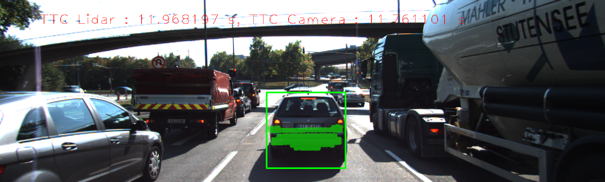
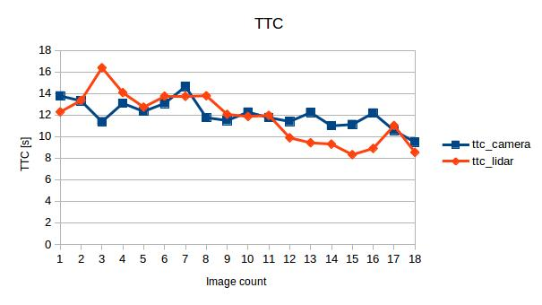

# SFND 3D Object Tracking

Welcome to the final project of the camera course. By completing all the lessons, you now have a solid understanding of keypoint detectors, descriptors, and methods to match them between successive images. Also, you know how to detect objects in an image using the YOLO deep-learning framework. And finally, you know how to associate regions in a camera image with Lidar points in 3D space. Let's take a look at our program schematic to see what we already have accomplished and what's still missing.


In this final project, you will implement the missing parts in the schematic. To do this, you will complete four major tasks: 
1. First, you will develop a way to match 3D objects over time by using keypoint correspondences. 
2. Second, you will compute the TTC based on Lidar measurements. 
3. You will then proceed to do the same using the camera, which requires to first associate keypoint matches to regions of interest and then to compute the TTC based on those matches. 
4. And lastly, you will conduct various tests with the framework. Your goal is to identify the most suitable detector/descriptor combination for TTC estimation and also to search for problems that can lead to faulty measurements by the camera or Lidar sensor. In the last course of this Nanodegree, you will learn about the Kalman filter, which is a great way to combine the two independent TTC measurements into an improved version which is much more reliable than a single sensor alone can be. But before we think about such things, let us focus on your final project in the camera course. 

## Dependencies for Running Locally
* cmake >= 2.8
  * All OSes: [click here for installation instructions](https://cmake.org/install/)
* make >= 4.1 (Linux, Mac), 3.81 (Windows)
  * Linux: make is installed by default on most Linux distros
  * Mac: [install Xcode command line tools to get make](https://developer.apple.com/xcode/features/)
  * Windows: [Click here for installation instructions](http://gnuwin32.sourceforge.net/packages/make.htm)
* OpenCV >= 4.1
  * This must be compiled from source using the `-D OPENCV_ENABLE_NONFREE=ON` cmake flag for testing the SIFT and SURF detectors.
  * The OpenCV 4.1.0 source code can be found [here](https://github.com/opencv/opencv/tree/4.1.0)
* gcc/g++ >= 5.4
  * Linux: gcc / g++ is installed by default on most Linux distros
  * Mac: same deal as make - [install Xcode command line tools](https://developer.apple.com/xcode/features/)
  * Windows: recommend using [MinGW](http://www.mingw.org/)

## Basic Build Instructions

1. Clone this repo.
2. Make a build directory in the top level project directory: `mkdir build && cd build`
3. Compile: `cmake .. && make`
4. Run it: `./3D_object_tracking`.


## Implementation

### 2. Compute Lidar-based TTC
Compute the time-to-collision in second for all matched 3D objects using only Lidar measurements from the matched bounding boxes between current and previous frame.

```c++
void computeTTCLidar(std::vector<LidarPoint> &lidarPointsPrev,
                     std::vector<LidarPoint> &lidarPointsCurr,
                     double frameRate, double &TTC)
{
    double laneWidth = 4.0; 
    vector<double> xp, xc;
    // get lidar points within the lane
    for (auto it = lidarPointsPrev.begin(); it != lidarPointsPrev.end(); ++it)
    {
        if (abs(it->y) <= laneWidth / 2.0)
        { 
            xp.push_back(it->x);
        }
    }
    for (auto it = lidarPointsCurr.begin(); it != lidarPointsCurr.end(); ++it)
    {
        if (abs(it->y) <= laneWidth / 2.0)
        { 
            xc.push_back(it->x);
        }
    }
    
    // get the mean point
    double meanXP = 0; 
    double meanXC = 0;
    if (xp.size() > 0)
    {          
      
      for (auto x: xp)
       {
            meanXP += x;
       }
       meanXP = meanXP / xp.size();
    }
    if (xc.size() > 0)
    {  
       for (auto x: xc)
       {
           meanXC += x;
       }
       meanXC = meanXC / xc.size();
    }  
    // compute TTC
    double dt = 1 / frameRate;
    TTC = meanXC * dt / (meanXP - meanXC);
    
}
```

### 3 Associate Keypoint Correspondences with Bounding Boxes
Prepare the TTC computation based on camera measurements by associating keypoint correspondences to the bounding boxes which enclose them. All matches which satisfy this condition must be added to a vector in the respective bounding box.

```c++
void clusterKptMatchesWithROI(BoundingBox &boundingBox, std::vector<cv::KeyPoint> &kptsPrev, std::vector<cv::KeyPoint> &kptsCurr, std::vector<cv::DMatch> &kptMatches)
{
    double meanDistance = 0;
    std::vector<cv::DMatch>  kptMatches_roi;
  
    for  (auto it=kptMatches.begin(); it != kptMatches.end(); ++ it)
    {
        cv::KeyPoint kp = kptsCurr.at(it->trainIdx);
        auto cv_pt = cv::Point(kp.pt.x, kp.pt.y);

        if (boundingBox.roi.contains(cv_pt)) 
          kptMatches_roi.push_back(*it);           
    }  
    
    // get the mean distance
    for  (auto it = kptMatches_roi.begin(); it != kptMatches_roi.end(); ++it)
    {
         meanDistance += it->distance;
    }
    
    if  (kptMatches_roi.size() > 0)
    {  
        meanDistance = meanDistance / kptMatches_roi.size();
        double threshold = meanDistance * 0.7;        
        for  (auto it = kptMatches_roi.begin(); it != kptMatches_roi.end(); ++it)
        {
            if (it->distance < threshold)
                boundingBox.kptMatches.push_back(*it);
        }
    }
}
```

### 4 Compute Camera-based TTC
Compute the time-to-collision in second for all matched 3D objects using only keypoint correspondences from the matched bounding boxes between current and previous frame.

```c++
// Compute time-to-collision (TTC) based on keypoint correspondences in successive images
void computeTTCCamera(std::vector<cv::KeyPoint> &kptsPrev, std::vector<cv::KeyPoint> &kptsCurr, 
                      std::vector<cv::DMatch> kptMatches, double frameRate, double &TTC, cv::Mat *visImg)
{
    vector<double> distRatios;
    for (auto it1 = kptMatches.begin(); it1 != kptMatches.end() - 1; ++it1) {
        cv::KeyPoint kpOuterCurr = kptsCurr.at(it1->trainIdx);  
        cv::KeyPoint kpOuterPrev = kptsPrev.at(it1->queryIdx);  

        for (auto it2 = kptMatches.begin() + 1; it2 != kptMatches.end(); ++it2) {
            cv::KeyPoint kpInnerCurr = kptsCurr.at(it2->trainIdx);  
            cv::KeyPoint kpInnerPrev = kptsPrev.at(it2->queryIdx);  

            double distCurr = cv::norm(kpOuterCurr.pt - kpInnerCurr.pt);
            double distPrev = cv::norm(kpOuterPrev.pt - kpInnerPrev.pt);

            double minDist = 100.0;   

            if (distPrev > std::numeric_limits<double>::epsilon() && distCurr >= minDist) {
                double distRatio = distCurr / distPrev;
                distRatios.push_back(distRatio);
            }
        }
    }

    if (distRatios.size() != 0)
    {
        double medianDistRatio;  
        std::sort(distRatios.begin(), distRatios.end());
        if (distRatios.size() % 2 == 0)
        {
            medianDistRatio =  (distRatios[distRatios.size() / 2 - 1] + distRatios[distRatios.size() / 2]) / 2;
        }
        else 
        {
            medianDistRatio = distRatios[distRatios.size() / 2];
        }
        // Finally, calculate a TTC estimate based on these 2D camera features
        TTC = (-1.0 / frameRate) / (1 - medianDistRatio);
    } 
    else 
    {
        TTC = NAN;
    
    }
```


### 5 Performance Evaluation 1
Find examples where the TTC estimate of the Lidar sensor does not seem plausible. Describe your observations and provide a sound argumentation why you think this happened.

The TTC increases in some steps after it has decreased. This is not in line with the scene. This fluctuations can be based on the incorrect filtering of the the lidar points. 





### 6 Performance Evaluation 2
Run several detector / descriptor combinations and look at the differences in TTC estimation. Find out which methods perform best and also include several examples where camera-based TTC estimation is way off. As with Lidar, describe your observations again and also look into potential reasons.

A similar problem to lidar is also observed in the TTC calculated using camera. See the attached graph.
